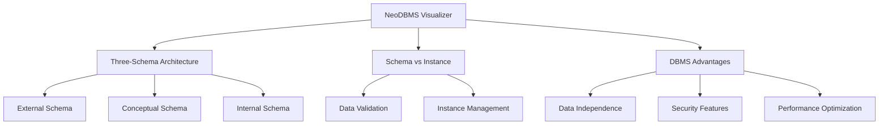
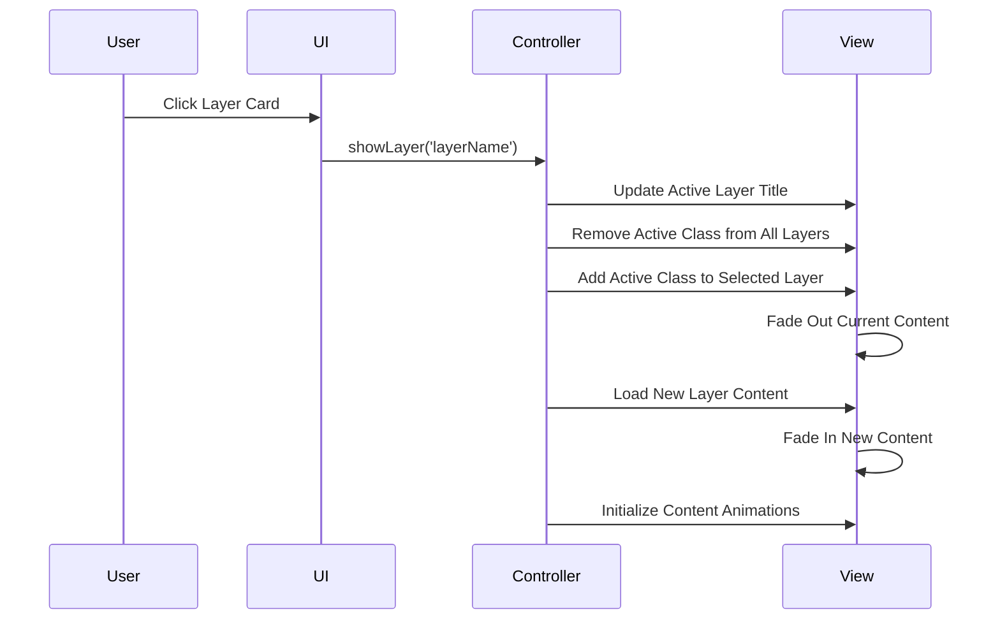
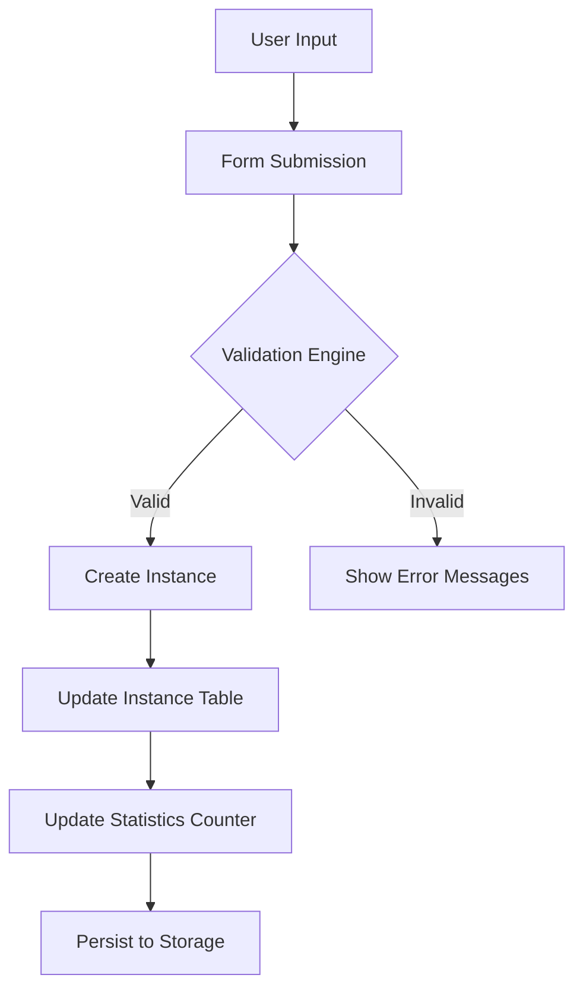
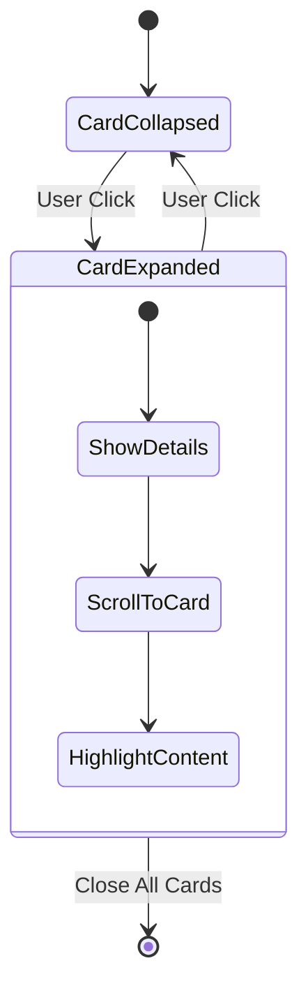
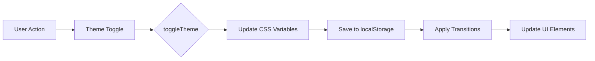
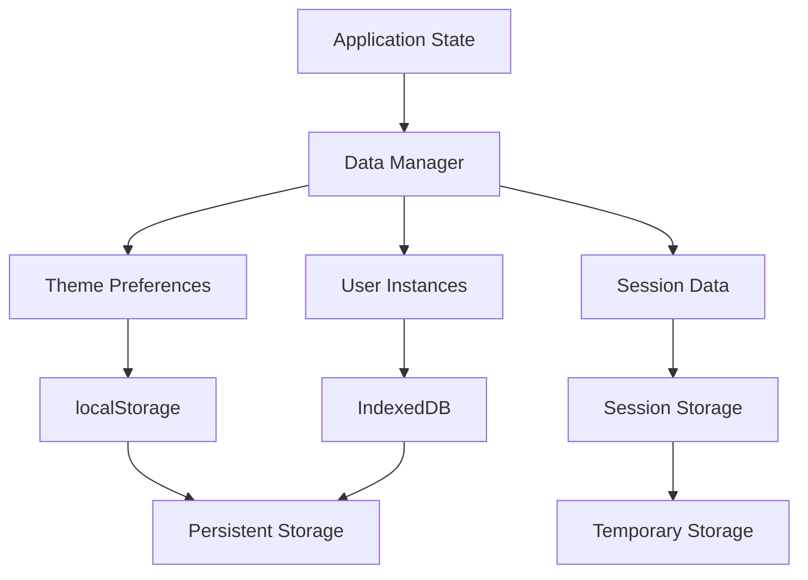
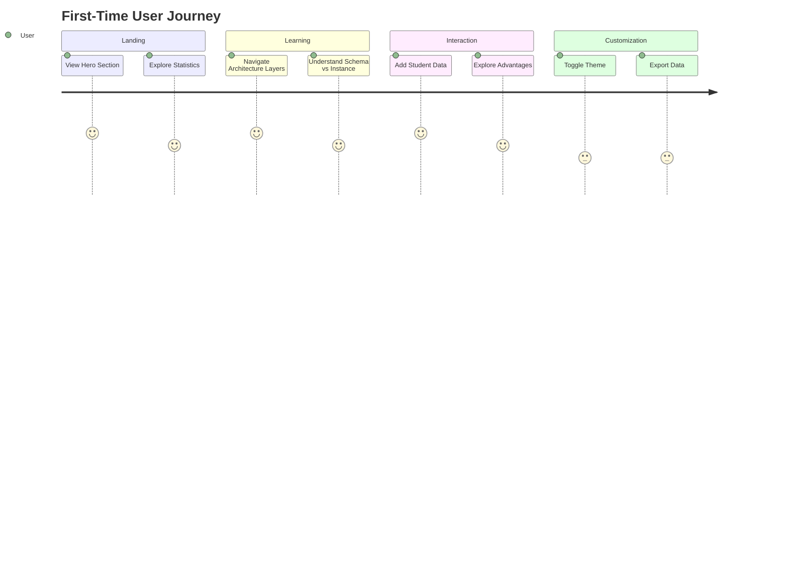
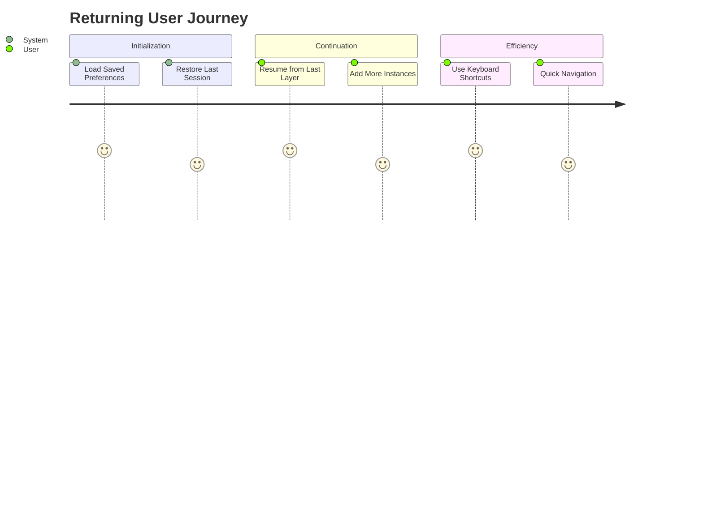

# DBMS Visualizer - How It Works

## 🎯 System Overview



## 🔄 Application Flow

### Initialization Sequence
```javascript
// Application Startup Flow
DOMContentLoaded → initializeTheme() → setupEventListeners() 
→ initializeAnimations() → showDefaultLayer('conceptual')
```

### Core Event Handling Matrix
| Event Type | Target Component | Handler Function | Description |
|------------|------------------|------------------|-------------|
| `click` | Layer Cards | `showLayer(layerName)` | Navigates between architecture layers |
| `submit` | Student Form | `handleStudentSubmit()` | Validates and adds new instances |
| `click` | Advantage Cards | `toggleAdvantage()` | Expands/collapses feature details |
| `click` | Theme Toggle | `toggleTheme()` | Switches between dark/light themes |
| `keydown` | Document | `handleKeyboardShortcuts()` | Global keyboard navigation |

## 🏗️ Three-Schema Architecture

### Layer Navigation System


### Layer Content Structure
```javascript
const layerContent = {
    external: {
        title: "External Schema",
        description: "User-level views and application interfaces",
        features: [
            "Multiple User Views",
            "Application-specific Data Mapping",
            "Enhanced Security through View Isolation"
        ],
        visualization: "view-mapping-diagram"
    },
    conceptual: {
        title: "Conceptual Schema",
        description: "Global logical structure of the entire database",
        features: [
            "Entity-Relationship Models",
            "Business Rules and Constraints",
            "Logical Data Independence"
        ],
        visualization: "er-diagram"
    },
    internal: {
        title: "Internal Schema",
        description: "Physical storage details and access methods",
        features: [
            "Storage Structures and File Organization",
            "Indexing and Access Paths",
            "Performance Optimization Techniques"
        ],
        visualization: "storage-layout"
    }
};
```

## 📊 Schema vs Instance System

### Data Flow Architecture


### Validation Process
```javascript
class DataValidator {
    static validateStudentData(student) {
        const errors = [];
        const rules = {
            id: { 
                pattern: /^[1-9]\d{2,4}$/, 
                range: { min: 100, max: 99999 },
                message: "ID must be between 100-99999"
            },
            name: {
                pattern: /^[A-Za-z\s]{2,50}$/,
                message: "Name must be 2-50 letters only"
            },
            age: {
                range: { min: 16, max: 100 },
                message: "Age must be between 16-100"
            },
            email: {
                pattern: /^[^\s@]+@[^\s@]+\.[^\s@]+$/,
                message: "Must be a valid email format"
            }
        };

        // Validate each field
        Object.keys(rules).forEach(field => {
            const value = student[field];
            const rule = rules[field];
            
            if (rule.pattern && !rule.pattern.test(value)) {
                errors.push(rule.message);
            }
            
            if (rule.range && (value < rule.range.min || value > rule.range.max)) {
                errors.push(rule.message);
            }
        });

        // Check for duplicates
        if (this.isDuplicateId(student.id)) {
            errors.push("Student ID already exists");
        }

        return errors;
    }
}
```

## ⭐ DBMS Advantages System

### Interactive Card Architecture


### Advantage Card Structure
```html
<!-- Example Advantage Card -->
<div class="advantage-card" data-advantage="dataIndependence">
    <div class="card-header" onclick="toggleAdvantage('dataIndependence')">
        <div class="icon">🛡️</div>
        <h3>Data Independence</h3>
        <div class="badge">Core Feature</div>
        <div class="indicator">▶</div>
    </div>
    
    <div class="card-preview">
        Applications insulated from storage structure changes
    </div>
    
    <div class="card-details" id="dataIndependence">
        <div class="comparison-grid">
            <div class="pros-section">
                <h4>✅ DBMS Benefits</h4>
                <ul>
                    <li>Logical and physical separation</li>
                    <li>Easy schema evolution</li>
                    <li>Reduced application maintenance</li>
                </ul>
            </div>
            <div class="cons-section">
                <h4>❌ File System Issues</h4>
                <ul>
                    <li>Tight coupling with storage</li>
                    <li>High maintenance costs</li>
                    <li>Difficult to evolve</li>
                </ul>
            </div>
        </div>
    </div>
</div>
```

## 🎨 Theme System Architecture

### Theme Switching Mechanism


### CSS Variable Implementation
```css
/* Theme System Root Variables */
:root {
    /* Dark Theme Defaults */
    --bg-primary: #0f0f23;
    --bg-secondary: #1a1a2e;
    --text-primary: #ffffff;
    --text-secondary: #cbd5e1;
    --accent-primary: #4f46e5;
    --accent-secondary: #06d6a0;
    --border-color: #374151;
    --shadow-intensity: 0.8;
}

[data-theme="light"] {
    /* Light Theme Overrides */
    --bg-primary: #f0f4ff;
    --bg-secondary: #ffffff;
    --text-primary: #1a1a2e;
    --text-secondary: #475569;
    --border-color: #e2e8f0;
    --shadow-intensity: 0.3;
}

/* Component Styling */
.component {
    background-color: var(--bg-secondary);
    color: var(--text-primary);
    border: 1px solid var(--border-color);
    transition: var(--transition);
}
```

## ⌨️ Keyboard Shortcuts System

### Global Shortcut Handler
```javascript
class KeyboardManager {
    constructor() {
        this.shortcuts = new Map([
            ['ctrl+t', { action: 'toggleTheme', description: 'Toggle theme' }],
            ['ctrl+e', { action: 'exportData', description: 'Export data' }],
            ['ctrl+1', { action: 'showExternal', description: 'Show external schema' }],
            ['ctrl+2', { action: 'showConceptual', description: 'Show conceptual schema' }],
            ['ctrl+3', { action: 'showInternal', description: 'Show internal schema' }],
            ['ctrl+?', { action: 'showHelp', description: 'Show keyboard shortcuts' }]
        ]);
        
        this.initialize();
    }

    handleKeyPress(event) {
        const key = this.getKeyCombo(event);
        const shortcut = this.shortcuts.get(key);
        
        if (shortcut) {
            event.preventDefault();
            this.executeAction(shortcut.action);
        }
    }

    getKeyCombo(event) {
        const parts = [];
        if (event.ctrlKey || event.metaKey) parts.push('ctrl');
        if (event.shiftKey) parts.push('shift');
        if (event.altKey) parts.push('alt');
        parts.push(event.key.toLowerCase());
        
        return parts.join('+');
    }
}
```

## 📱 Responsive Design System

### Breakpoint Strategy
```css
/* Mobile First Approach */
.container { 
    width: 100%; 
    padding: 1rem; 
}

/* Tablet */
@media (min-width: 768px) {
    .container { 
        max-width: 720px; 
        margin: 0 auto;
    }
    .grid-2 { grid-template-columns: repeat(2, 1fr); }
}

/* Desktop */
@media (min-width: 1024px) {
    .container { 
        max-width: 1200px; 
        padding: 2rem;
    }
    .grid-3 { grid-template-columns: repeat(3, 1fr); }
    .sidebar-layout { 
        display: grid;
        grid-template-columns: 300px 1fr;
        gap: 2rem;
    }
}
```

### Layout Adaptation Matrix
| Screen Size | Architecture Layout | Schema/Instance | Advantages Grid |
|-------------|---------------------|-----------------|-----------------|
| **Mobile** (<768px) | Vertical stack | Single column | 1 column |
| **Tablet** (768px-1023px) | Stacked with connectors | Side-by-side | 2 columns |
| **Desktop** (1024px+) | Horizontal layout | Side-by-side expanded | 3 columns |

## 💾 Data Persistence System

### Storage Architecture


### Storage Implementation
```javascript
class StorageManager {
    constructor() {
        this.prefix = 'neodbms_';
    }

    // Theme persistence
    saveTheme(theme) {
        localStorage.setItem(`${this.prefix}theme`, theme);
    }

    loadTheme() {
        return localStorage.getItem(`${this.prefix}theme`) || 'dark';
    }

    // Instance data management
    saveInstances(instances) {
        const data = {
            timestamp: Date.now(),
            version: '1.0',
            instances: instances
        };
        localStorage.setItem(`${this.prefix}instances`, JSON.stringify(data));
    }

    loadInstances() {
        const data = localStorage.getItem(`${this.prefix}instances`);
        return data ? JSON.parse(data).instances : [];
    }
}
```

## 🎯 User Journey Maps

### First-Time User Experience


### Returning User Experience


## 🔧 Core Technical Components

### Initialization Sequence
```javascript
// Main application initialization
class NeoDBMSVisualizer {
    constructor() {
        this.currentLayer = 'conceptual';
        this.theme = 'dark';
        this.instances = [];
        this.initialized = false;
    }

    async initialize() {
        try {
            await this.loadPreferences();
            this.setupEventListeners();
            this.initializeAnimations();
            this.showLayer(this.currentLayer);
            this.initialized = true;
            
            console.log('NeoDBMS Visualizer initialized successfully');
        } catch (error) {
            console.error('Initialization failed:', error);
        }
    }

    setupEventListeners() {
        // Layer navigation
        document.querySelectorAll('.layer-card').forEach(card => {
            card.addEventListener('click', () => {
                this.showLayer(card.dataset.layer);
            });
        });

        // Theme toggle
        document.getElementById('themeToggle').addEventListener('click', () => {
            this.toggleTheme();
        });

        // Form submission
        document.getElementById('studentForm').addEventListener('submit', (e) => {
            e.preventDefault();
            this.handleStudentSubmit(e);
        });

        // Keyboard shortcuts
        document.addEventListener('keydown', (e) => {
            this.handleKeyboardShortcuts(e);
        });
    }
}
```

### Animation System Architecture
```javascript
class AnimationManager {
    constructor() {
        this.intersectionObserver = new IntersectionObserver(
            this.handleIntersection.bind(this),
            { threshold: 0.1 }
        );
    }

    // Scroll-triggered animations
    handleIntersection(entries) {
        entries.forEach(entry => {
            if (entry.isIntersecting) {
                entry.target.classList.add('animate-in');
            }
        });
    }

    // Content transitions
    async transitionContent(outElement, inElement) {
        // Fade out current content
        outElement.style.opacity = '0';
        outElement.style.transform = 'translateY(10px)';
        
        await this.delay(300);
        
        // Swap content
        outElement.style.display = 'none';
        inElement.style.display = 'block';
        
        // Fade in new content
        await this.delay(50);
        inElement.style.opacity = '1';
        inElement.style.transform = 'translateY(0)';
    }

    delay(ms) {
        return new Promise(resolve => setTimeout(resolve, ms));
    }
}
```
