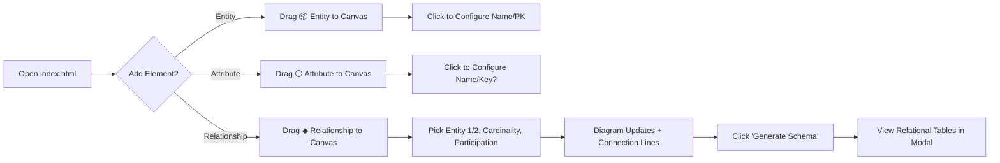
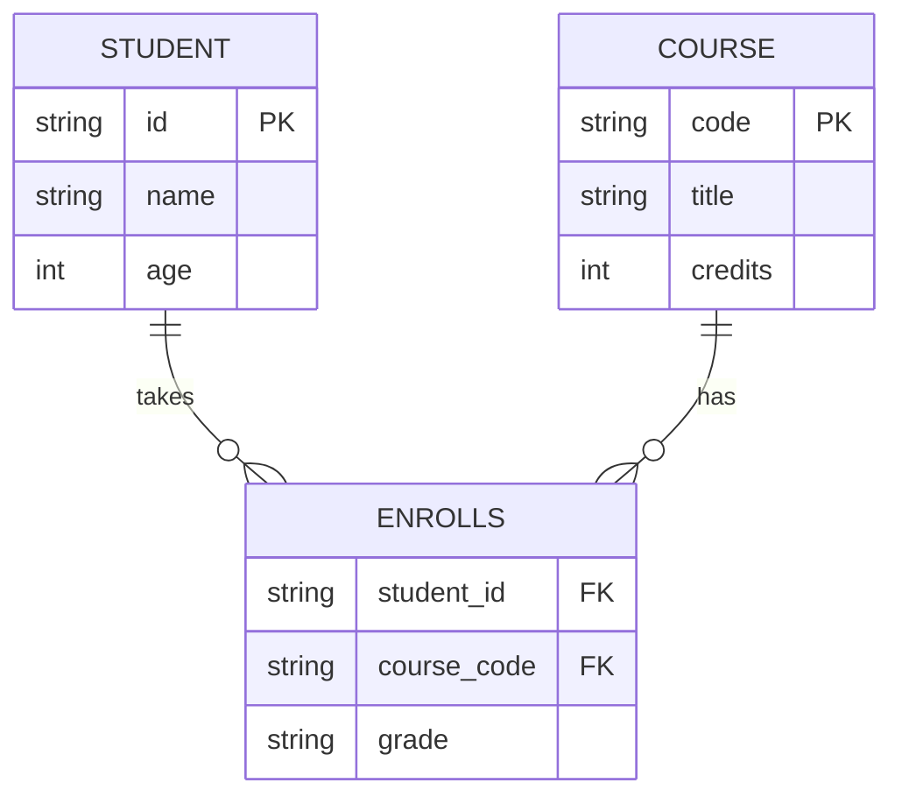
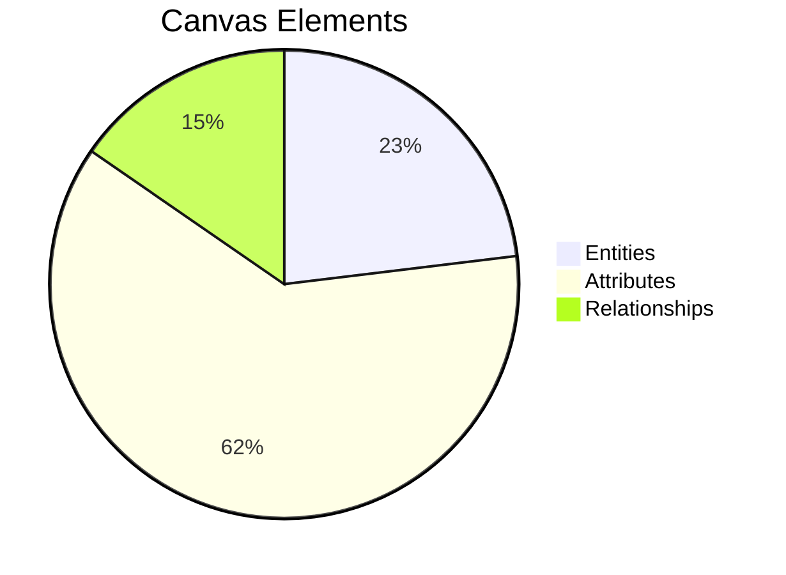
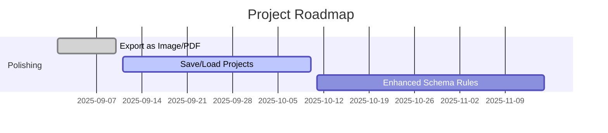
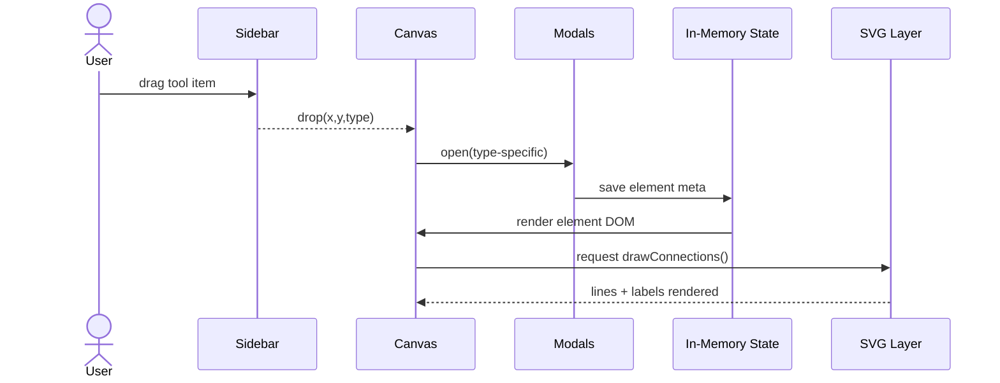

# 📊 ER/EER Diagram Builder

An interactive drag‑and‑drop tool for designing **ER (Entity‑Relationship)** and **EER** diagrams right in your browser. It also auto‑generates a **Relational Schema** from your diagram.

---

## 🚀 Features at a Glance

- 🎨 Drag‑and‑drop: Entities, attributes (simple/composite/derived/multivalued), relationships
- 🧭 Cardinality & participation: 1, N; partial/total
- 🧩 Auto‑wires connections and updates lines while you move things
- 🗃️ One‑click **Relational Schema** generator
- 🌓 Dark Mode toggle
- ➕ Floating Action Button (FAB) for quick actions
- 🧹 Clear, delete‑selected, and history helpers (undo/redo stubs)

---

## 📁 Project Structure

```
er-eer-builder/
├── index.html      # Main structure & modals
├── styles.css      # Styling, layout, dark mode
└── script.js       # Interactivity & schema generation
```

Open `index.html` in your browser to run.

---

## 🧰 Quick Start (Visual Guide)



---

## 🧪 Example: Mini University Model

> Try creating this small model to test everything works.



**What to expect in "Generate Schema":**  
- `STUDENT(id [PK], name, age)`  
- `COURSE(code [PK], title, credits)`  
- M:N via `ENROLLS(student_id [PK, FK→STUDENT], course_code [PK, FK→COURSE], grade)`

---

## 📈 In‑App Analytics (Sample Visuals)

> Not part of the app logic—just a helpful mental model for what you might track later.

### Element Distribution (example)


### Roadmap Snapshot


---

## 🖱️ Controls & Shortcuts

- **Drag from sidebar** → drop to canvas
- **Click an element** → open config modal (name, PK, properties)
- **Drag on canvas** → reposition (lines auto‑update)
- **Delete Selected** → removes highlighted element
- **Clear Canvas** → wipe everything
- **Dark Mode** → toggle in top‑right

> History (undo/redo) helpers are scaffolded; implementing full keyboard shortcuts is a good next step.

---

## 🧠 Design Notes (Architecture)



**State Shape**
- `entities[]` → `{ id, name, attributes[], pk, x, y }`
- `attributes[]` → `{ id, name, subtype, isKey, x, y }`
- `relationships[]` → `{ id, name, entity1, entity2, cardinality1, cardinality2, participation1, participation2, x, y }`

---

## 🛠️ Tech Stack

- **HTML5** (semantic, modals)
- **CSS3** (layout, theming, dark mode)
- **JavaScript (ES6)** (drag/drop, wiring, schema generation)
- **SVG** (connections overlay)
- **Mermaid** (docs‑only visuals in this README)

---

## 🧩 Known Gaps / Nice‑to‑Haves

- Implement `createEntityOnCanvas`, `createAttributeOnCanvas`, `createRelationshipOnCanvas` used by `renderCanvas()` for full undo/redo restore.
- Snap‑to‑grid & magnet anchors for cleaner lines.
- Export: PNG/SVG/PDF of canvas + schema.
- Persist & load projects from localStorage / JSON.
- Attribute‑to‑entity linking UI for richer semantics.

---

## 🔐 Tips for Classroom or Team Use

- Prefer separate user accounts; avoid sharing a single login.
- Version the project (e.g., Git) so you can save milestone diagrams.
- When presenting, keep the **How to Use** modal handy for orientation.

---

## 📜 License

MIT — free to use, modify, and share.

---

## 🙌 Credits

Built to help learners grasp ER/EER concepts quickly through **visual play + instant schema generation**.
