# Relational Algebra Visualizer (developed by Rayn Roshid (590014615))


An interactive web-based tool for learning and practicing relational algebra operations with real-time visualization and intuitive interface.

## 🚀 Features

### Core Operations
- **SELECT (σ)** - Filter rows based on conditions
- **PROJECT (π)** - Choose specific columns
- **JOIN (⨝)** - Combine tables on matching values
- **UNION (∪)** - Combine rows from compatible tables
- **DIFFERENCE (-)** - Find rows in first table not in second
- **INTERSECT (∩)** - Find common rows between tables

### Visual Features


## 🎯 User Interface Overview


### Layout Components
1. **Header Panel** - Application title and statistics
2. **Creation Panel** - Table creation and data input
3. **Operations Panel** - Relational algebra operations
4. **Tables Display** - Visual representation of relations
5. **Results Panel** - Operation results and visualization
6. **History Panel** - Operation tracking and history

## 📊 Architecture Diagram


## 🛠️ Installation & Setup

### Prerequisites
- Modern web browser (Chrome 90+, Firefox 88+, Safari 14+)
- Local web server (optional, for file serving)

### Quick Start
1. **Clone or Download** the project files:
   ```
   Q5.html
   Q5.css  
   Q5.js
   ```

2. **Open in Browser**:
   - Direct file opening: `Q5.html`
   - Or serve via local server for best experience

3. **Start Creating**:
   - Use sample data or create custom tables
   - Apply relational algebra operations
   - Visualize results in real-time

## 📖 Usage Guide

### Creating Tables
```
Table Creation Flow:
1. Enter table name → Define columns → Input data
2. Validate schema compatibility
3. Auto-detect data types
4. Store with metadata
```

### Operation Workflow


## 🎨 Theme System

### Dark Theme (Default)
- Deep blue gradient background
- Glass morphism effects
- High contrast text

### Light Theme  
- Light gray gradient background
- Subtle shadows and borders
- Reduced eye strain

### Theme Comparison
| Feature | Dark Theme | Light Theme |
|---------|------------|-------------|
| Background | #0f172a | #f8fafc |
| Text Color | #f1f5f9 | #1e293b |
| Card Background | rgba(30,41,59,0.8) | rgba(255,255,255,0.9) |
| Primary Color | #6366f1 | #6366f1 |

## 🔧 Technical Implementation

### Data Structure
```javascript
Table Structure:
{
  tableName: {
    columns: ['col1', 'col2', ...],
    data: [[val1, val2, ...], ...],
    schema: {
      column: { type: 'string|number|boolean', nullable: boolean }
    },
    createdAt: ISOString
  }
}
```

### Operation Performance


### Browser Compatibility
| Browser | Version | Support |
|---------|---------|---------|
| Chrome | 90+ | ✅ Full |
| Firefox | 88+ | ✅ Full |
| Safari | 14+ | ✅ Full |
| Edge | 90+ | ✅ Full |

## 📋 Sample Data Schema

### Students Table
| Column | Type | Description | Sample |
|--------|------|-------------|---------|
| StudentID | Number | Unique identifier | 1, 2, 3 |
| Name | String | Student name | "Alice Johnson" |
| Major | String | Field of study | "Computer Science" |
| GPA | Number | Grade point average | 3.8, 3.5 |
| Year | String | Academic year | "Senior", "Junior" |

### Courses Table
| Column | Type | Description |
|--------|------|-------------|
| CourseID | String | Course code | "CS101" |
| CourseName | String | Course title | "Introduction to Programming" |
| Department | String | Offering department | "Computer Science" |
| Credits | Number | Credit hours | 4 |

### Enrollments Table (Join Table)
| Column | Type | Description |
|--------|------|-------------|
| EnrollmentID | Number | Unique enrollment ID |
| StudentID | Number | References Students |
| CourseID | String | References Courses |
| Grade | String | Letter grade | "A", "B+" |
| Semester | String | Academic term | "Fall 2024" |

## 🎮 Interactive Features

### Visual Feedback System
- **Hover Effects**: Scale and glow animations
- **Loading States**: Animated spinners with progress
- **Notifications**: Toast messages for user feedback
- **Transitions**: Smooth CSS animations throughout

### Keyboard Shortcuts
| Shortcut | Action | Description |
|----------|--------|-------------|
| `Ctrl+N` | New Table | Focus table name input |
| `Ctrl+D` | Sample Data | Load sample datasets |
| `Esc` | Clear Results | Hide results panel |
| `Ctrl+H` | Clear History | Reset operation history |

## 📈 Performance Metrics

### Operation Benchmarks

```mermaid
graph TB
    A[Operation Type] --> B[SELECT]
    A --> C[PROJECT]  
    A --> D[JOIN]
    A --> E[Set Operations]
    
    B --> F[<50ms for 1K rows]
    C --> G[<30ms for 1K rows]
    D --> H[<100ms for 1K×1K join]
    E --> I[<80ms for 1K rows]
```


### Memory Usage
- **Small datasets**: < 10MB
- **Medium datasets**: 10-50MB  
- **Large datasets**: 50-200MB (depending on operations)

## 🔍 Advanced Features

### Schema Inference
- Automatic data type detection
- Nullability analysis
- Type preservation across operations

### Error Handling
- Comprehensive validation
- User-friendly error messages
- Graceful failure recovery

### Export Capabilities
- CSV export functionality
- Result persistence as tables
- Operation history tracking

## 🌟 Educational Value

### Learning Path


### Use Cases
- **Computer Science Education**: Database course supplement
- **Self-Learning**: Interactive relational algebra practice
- **Professional Development**: SQL concept reinforcement
- **Research**: Algorithm visualization and testing

## 🐛 Troubleshooting

### Common Issues
1. **Performance Slowdown**
   - Reduce table sizes
   - Use more specific SELECT conditions

2. **Operation Errors** 
   - Verify schema compatibility for set operations
   - Check condition syntax in SELECT operations

3. **Display Issues**
   - Ensure browser is up to date
   - Check browser console for errors

### Browser Support Notes
- Requires ES6+ support
- CSS Grid and Flexbox required
- Local storage used for theme persistence

---

**Relational Algebra Visualizer** - Making database concepts visual and interactive! 🎓