# Transaction Management Simulator - Complete Documentation


## 📋 Table of Contents
1. [Project Overview](#-project-overview)
2. [Features](#-features)
3. [Technical Architecture](#-technical-architecture)
4. [Installation & Setup](#-installation--setup)
5. [User Guide](#-user-guide)
6. [Code Structure](#-code-structure)
7. [API Reference](#-api-reference)
8. [Educational Value](#-educational-value)
9. [Troubleshooting](#-troubleshooting)
10. [Future Enhancements](#-future-enhancements)

## 🎯 Project Overview

An interactive web-based educational tool that visually demonstrates database transaction concepts through engaging simulations and real-time visualizations.

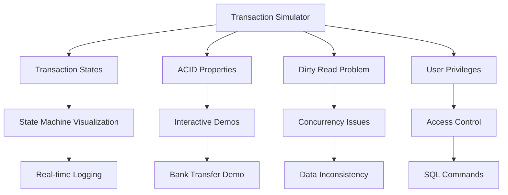

## 🚀 Features

### 1. Transaction State Management
**Complete State Machine Implementation**

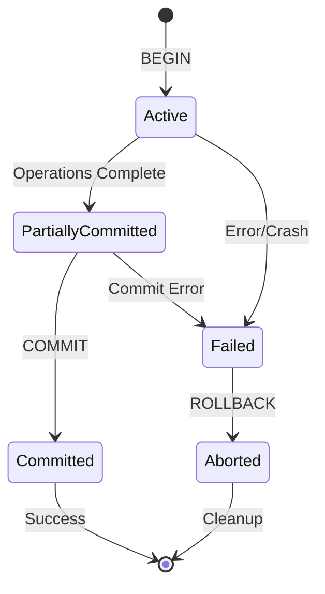

**Key Components:**
- **Visual State Indicators**: Real-time state transitions with animations
- **Transaction Logging**: Comprehensive audit trail
- **Failure Simulation**: System crash and recovery scenarios
- **Interactive Controls**: Begin, Commit, Rollback, Simulate Crash

### 2. ACID Properties Demos
**Four Interactive Learning Modules**

#### Atomicity Demo
```mermaid
sequenceDiagram
    participant A as Account A
    participant T as Transaction
    participant B as Account B
    participant S as System
    
    A->>T: Begin Transfer ₹2,000
    T->>A: Debit ₹2,000
    T->>B: Credit ₹2,000
    alt Success
        T->>S: COMMIT
        S->>A: Confirm Debit
        S->>B: Confirm Credit
    else Failure
        T->>S: ROLLBACK
        S->>A: Restore Balance
        S->>B: No Changes
    end
```

#### Consistency Demo
- **Balance Constraints**: Enforce non-negative balances
- **Rule Validation**: Pre- and post-transaction checks
- **Constraint Violation**: Visual feedback for rule breaches

#### Isolation Demo
```mermaid
graph LR
    T1[T1: Read Balance] --> D[Database: ₹10,000]
    T2[T2: Read Balance] --> D
    T3[T1: Update Balance] --> D2[Database: ₹8,000]
    T4[T2: Consistent Read] --> D3[Database: ₹10,000]
```

#### Durability Demo
- **Crash Simulation**: Instant system failure
- **Recovery Process**: Transaction log replay
- **Data Persistence**: Committed changes survival

### 3. Dirty Read Problem
**Concurrency Control Visualization**

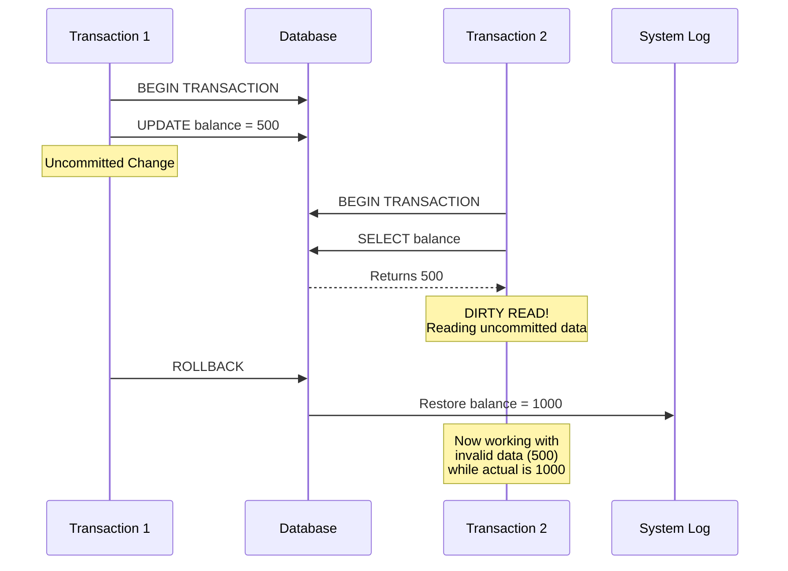

### 4. User Privileges Management
**Role-Based Access Control System**

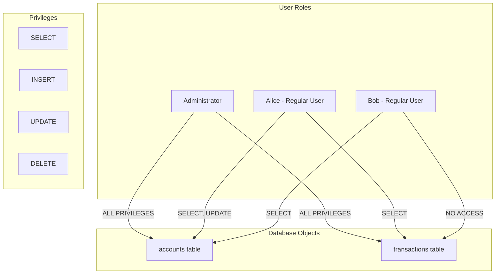

## 🛠️ Technical Architecture

### System Architecture Diagram
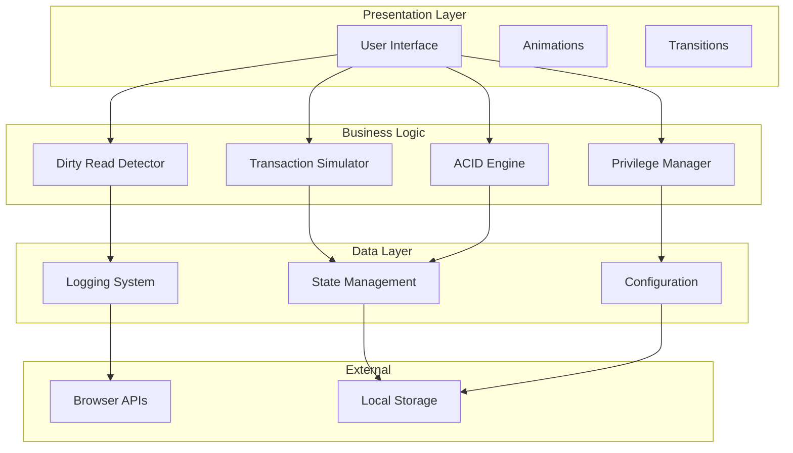

### File Structure
```
transaction-simulator/
│
├── Q7.html                 # Main HTML structure
├── Q7.css                  # Styles and animations
├── Q7.js                   # Core application logic
│
├── components/             # UI Components
│   ├── state-machine/      # Transaction states
│   ├── acid-demos/         # ACID property simulations
│   ├── dirty-read/         # Concurrency issues
│   └── privileges/         # Access control
│
└── assets/
    ├── images/             # Visual assets
    └── icons/              # UI icons
```

### Technology Stack
| Layer | Technology | Purpose |
|-------|------------|---------|
| **Frontend** | HTML5, CSS3, JavaScript ES6+ | Core web technologies |
| **Styling** | CSS Grid, Flexbox, Glass Morphism | Modern responsive design |
| **Animations** | CSS Transitions, Keyframes | Smooth user interactions |
| **Fonts** | Orbitron, Exo 2 | Typography and readability |
| **Icons** | Font Awesome 6.4.0 | Visual indicators |

## 📥 Installation & Setup

### Prerequisites
- **Web Browser**: Chrome 90+, Firefox 88+, Safari 14+, Edge 90+
- **JavaScript**: Must be enabled
- **Screen Resolution**: Minimum 1024×768 recommended
- **Internet**: Required for CDN resources (Fonts, Icons)

### Quick Installation
1. **Download Required Files**
   ```bash
   # Core application files
   Q7.html
   Q7.css  
   Q7.js
   ```

2. **Run the Application**
   ```bash
   # Method 1: Direct file opening
   open Q7.html
   
   # Method 2: Local server (recommended)
   python -m http.server 8000
   # Then visit: http://localhost:8000/Q7.html
   
   # Method 3: VS Code Live Server
   # Install Live Server extension and right-click Q7.html
   ```

3. **Verify Installation**
   - Animated background with stars should appear
   - Navigation menu with 4 sections visible
   - Interactive buttons should respond to clicks

### Browser Compatibility Matrix
| Browser | Version | Support | Notes |
|---------|---------|---------|--------|
| **Google Chrome** | 90+ | ✅ Full Support | Recommended |
| **Mozilla Firefox** | 88+ | ✅ Full Support | Excellent |
| **Apple Safari** | 14+ | ✅ Full Support | Good |
| **Microsoft Edge** | 90+ | ✅ Full Support | Excellent |
| **Opera** | 76+ | ✅ Full Support | Good |

## 📖 User Guide

### Getting Started
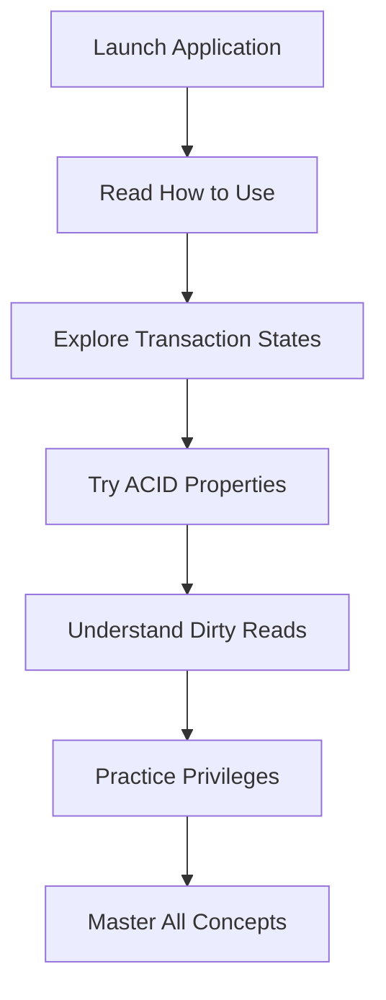

### 1. Transaction States Module

#### Step-by-Step Walkthrough
1. **Start Transaction**
   ```javascript
   // Click: "Start Transaction" button
   // Visual: Active state highlights
   // Log: "Transaction started: TX_123456789"
   ```

2. **Execute Operations**
   - Observe state transitions
   - Read real-time logs
   - Understand state flow

3. **Commit or Rollback**
   ```javascript
   // Success Path: Active → Partially Committed → Committed
   // Failure Path: Active → Failed → Aborted
   ```

4. **Simulate System Crash**
   - See automatic recovery
   - Understand rollback process
   - Learn durability concepts

### 2. ACID Properties Module

#### Atomicity Demo
**Bank Transfer Simulation**
```mermaid
graph LR
    A[Account A: ₹10,000] --> T[Transfer ₹2,000]
    B[Account B: ₹5,000] --> T
    T --> S1[Success: A=₹8,000 B=₹7,000]
    T --> S2[Failure: A=₹10,000 B=₹5,000]
```

**Interactive Steps:**
1. Click "Transfer ₹2,000" - Observe atomic update
2. Click "Simulate System Crash" - See rollback in action
3. Understand "all-or-nothing" principle

#### Consistency Demo
**Balance Constraint Enforcement**
```javascript
// Business Rule: Balance cannot be negative
function withdraw(amount) {
    if (currentBalance - amount >= 0) {
        // Allow withdrawal
        return success;
    } else {
        // Block transaction
        return error;
    }
}
```

#### Isolation Demo
**Concurrent Transaction Handling**
- Run multiple transactions simultaneously
- Observe non-interference
- Understand serializable execution

#### Durability Demo
**Crash Recovery Process**
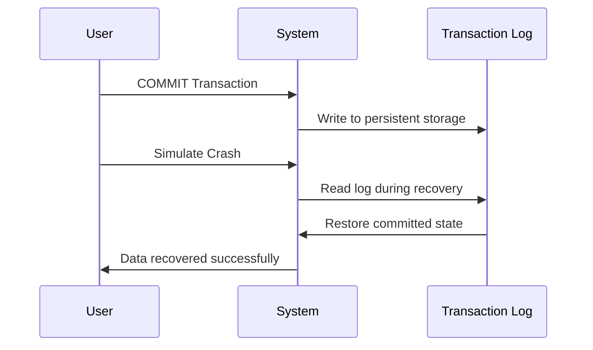

### 3. Dirty Read Module

#### Understanding the Problem
**Scenario Setup:**
- Transaction T1 updates balance but doesn't commit
- Transaction T2 reads the uncommitted balance
- T1 rolls back changes
- T2 has inconsistent data

**Step-by-Step Demonstration:**
1. **T1 Begins**: Start first transaction
2. **T1 Updates**: Change balance to ₹500 (uncommitted)
3. **T2 Begins**: Start second transaction  
4. **T2 Reads**: Observe dirty read of ₹500
5. **T1 Rollback**: Restore original balance
6. **Consequence**: T2 has wrong information

#### Prevention Strategies
- Use appropriate isolation levels
- Implement locking mechanisms
- Understand read phenomena

### 4. Privileges Management Module

#### User Management
**Available Roles:**
- **Administrator**: Full database access
- **Alice**: Regular user with specific privileges
- **Bob**: Restricted user with minimal access

#### Privilege Operations
**GRANT Syntax:**
```sql
GRANT SELECT, UPDATE ON accounts TO alice;
```

**REVOKE Syntax:**
```sql
REVOKE INSERT ON accounts FROM bob;
```

#### Access Testing
- Test SQL queries with current privileges
- See immediate permission feedback
- Understand privilege escalation

## 🔌 API Reference

### Transaction Management API

#### beginTransaction()
Starts a new database transaction.

**Parameters:** None  
**Returns:** Transaction object  
**Side Effects:**
- Updates UI state
- Enables transaction controls
- Adds log entry

```javascript
// Example Usage
beginTransaction();
// Result: Transaction TX_123456789 started
```

#### commitTransaction()
Commits the current transaction.

**Parameters:** None  
**Returns:** void  
**Side Effects:**
- Moves through commit states
- Updates visual indicators
- Logs completion

#### rollbackTransaction()
Rolls back the current transaction.

**Parameters:** None  
**Returns:** void  
**Side Effects:**
- Executes rollback process
- Restores previous state
- Logs rollback actions

### ACID Properties API

#### simulateBankTransfer(amount)
Demonstrates atomic money transfer.

**Parameters:**
- `amount` (Number): Transfer amount

**Returns:** void  
**Side Effects:** Updates account balances

```javascript
// Example: Transfer ₹2,000
simulateBankTransfer(2000);
```

#### simulateWithdrawal(amount)
Tests consistency constraints.

**Parameters:**
- `amount` (Number): Withdrawal amount

**Returns:** Success/Failure  
**Side Effects:** Updates balance if valid

### Privilege Management API

#### selectUser(user)
Changes the current active user.

**Parameters:**
- `user` (String): User identifier ('admin', 'alice', 'bob')

**Returns:** void  
**Side Effects:** Updates privilege UI

#### handlePrivilegeAction(action)
Executes privilege operations.

**Parameters:**
- `action` (String): 'grant', 'revoke', or 'execute'

**Returns:** void  
**Side Effects:** Modifies user privileges

## 🎓 Educational Value

### Learning Objectives

#### 1. Transaction Fundamentals
- Understand transaction lifecycle
- Learn state transitions
- Master commit/rollback concepts

#### 2. ACID Properties Mastery
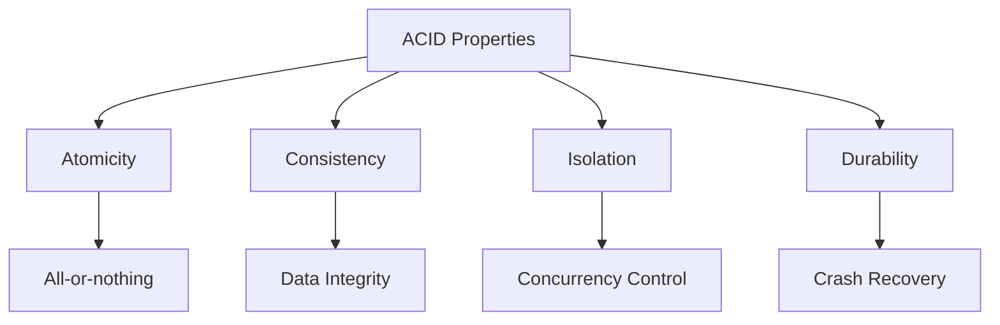

#### 3. Concurrency Issues
- Identify dirty reads
- Understand isolation levels
- Learn prevention strategies

#### 4. Security Principles
- Role-based access control
- Principle of least privilege
- SQL security commands

### Assessment Metrics
| Concept | Understanding Level | Assessment Method |
|---------|-------------------|------------------|
| **Transaction States** | Beginner → Expert | Interactive state machine |
| **ACID Properties** | Theoretical → Practical | Hands-on demos |
| **Concurrency Control** | Abstract → Concrete | Visual problem demonstration |
| **Security Management** | Basic → Advanced | Real-time privilege testing |

## 🐛 Troubleshooting

### Common Issues & Solutions

#### 1. Application Not Loading
**Symptoms:**
- Blank screen
- JavaScript errors in console
- Missing styles

**Solutions:**
```javascript
// Check browser console for errors
console.log('Application status:', {
    cssLoaded: !!document.styleSheets[0],
    jsLoaded: typeof TransactionSimulator !== 'undefined',
    fontsLoaded: document.fonts.check('1rem Orbitron')
});
```

#### 2. Performance Issues
**Optimization Tips:**
- Close other browser tabs
- Use hardware acceleration
- Update browser to latest version

#### 3. Feature-Specific Issues

**Transaction States Not Updating:**
- Verify JavaScript is enabled
- Check for console errors
- Refresh the application

**ACID Demos Not Working:**
- Ensure all files are loaded
- Check network connectivity for CDN resources
- Verify browser compatibility

### Debug Mode
Enable detailed logging for troubleshooting:
```javascript
// Add to browser console
localStorage.setItem('debug', 'true');
location.reload();
```

## 🔮 Future Enhancements

### Planned Features Roadmap
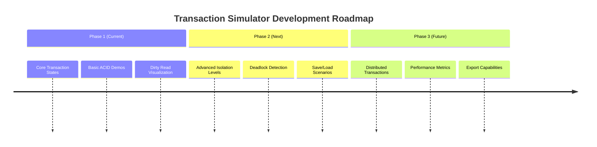

### Technical Improvements

#### 1. Enhanced Visualization
- 3D state transition diagrams
- Real-time performance metrics
- Advanced animation systems

#### 2. Additional Database Concepts
- Indexing strategies
- Query optimization
- Backup and recovery

#### 3. Extended Interactivity
- Custom scenario creation
- Multi-user collaboration
- Progress tracking

### Developed by Sandeep Jha (590014310)
This simulator was developed as an educational resource to make database transaction concepts accessible and understandable through interactive visualization.

---

## 🎉 Conclusion

The **Transaction Management Simulator** transforms abstract database concepts into tangible, interactive learning experiences. By combining visual demonstrations with hands-on practice, it bridges the gap between theoretical knowledge and practical understanding.

### Key Benefits:
- **Visual Learning**: Complex concepts made simple through animation
- **Interactive Practice**: Learn by doing with immediate feedback  
- **Comprehensive Coverage**: From basic transactions to advanced concurrency
- **Accessible Education**: Free tool for students and educators worldwide

### Get Started Today!
1. Download the application files
2. Open in your web browser  
3. Explore each learning module
4. Master database transaction management

**Happy Learning!** 🚀