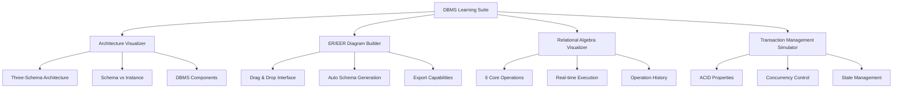
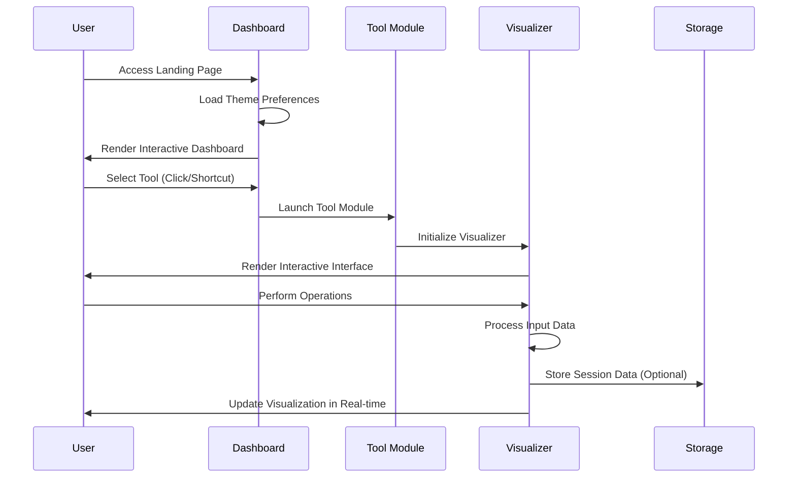
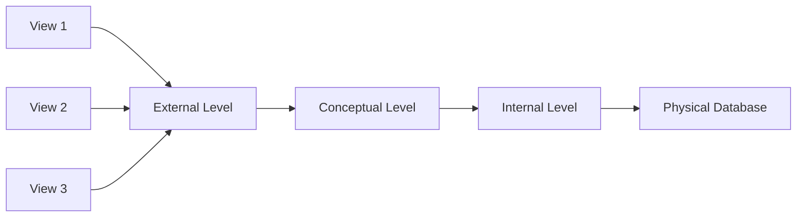
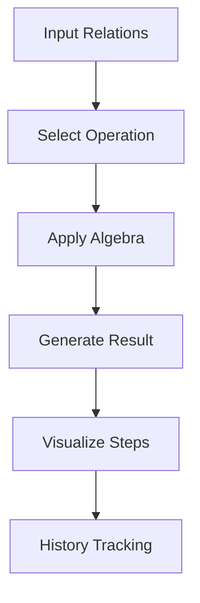
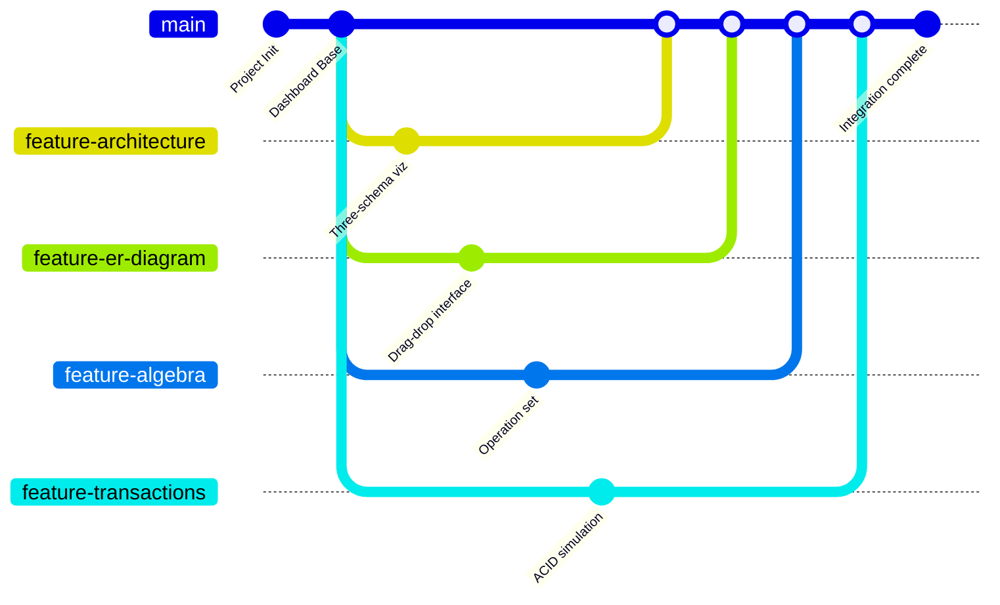

# 🚀 DBMS Learning Suite

**Interactive Database Management System Educational Platform**

> Developed by:\
> 👨‍💻 **Divyansh Kumar Singh** (590012175) - Team Lead & Developer\
> 👨‍💻 **Sandeep Jha** (50014310) - Developer\
> 👨‍💻 **Rayn Roshid** (590014615) - Developer

---

## 🌟 Overview

**DBMS Learning Suite** is a comprehensive educational platform that transforms complex Database Management System concepts into interactive, visual learning experiences. The suite bridges the gap between theoretical knowledge and practical understanding through hands-on simulations and real-time visualizations.



---

## 🏗️ System Architecture

### Frontend Architecture
```
📁 DBMS-Learning-Suite/
│
├── 📄 landing.html              # Main Dashboard
├── 🎨 landing.css               # Global Styles & Themes
├── ⚙️ landing.js                # Core Functionality
│
├── 📁 Q1/                       # Architecture Visualizer
│   ├── Q1.html
│   ├── Q1.css
│   ├── Q1.js
│   └── Q1.md
│
├── 📁 Q3/                       # ER/EER Diagram Builder
│   ├── Q3.html
│   ├── Q3.css
│   ├── Q3.js
│   └── Q3.md
│
├── 📁 Q5/                       # Relational Algebra Visualizer
│   ├── Q5.html
│   ├── Q5.css
│   ├── Q5.js
│   └── Q5.md
│
└── 📁 Q7/                       # Transaction Simulator
    ├── Q7.html
    ├── Q7.css
    ├── Q7.js
    └── Q7.md
```

### Component Interaction Flow


---

## ✨ Features

### 🎨 UI/UX Features
- **Dual Theme System**: Cosmic (Dark) & Light modes with seamless switching
- **Glassmorphism Design**: Modern frosted glass aesthetic
- **Custom Cursor System**: Enhanced interactive feedback
- **Responsive Layout**: Mobile-first adaptive design
- **Floating Animations**: Dynamic background elements

### ⌨️ Interaction Features
- **Keyboard Shortcuts**: Quick navigation (`Ctrl+1-4`, `Ctrl+T`, `Ctrl+?`)
- **Real-time Notifications**: User action feedback system
- **Smooth Transitions**: CSS-powered animations
- **Tooltip System**: Contextual help and guidance

### 📚 Educational Features
- **Visual Learning**: Complex concepts through interactive diagrams
- **Step-by-Step Execution**: Operation-by-operation visualization
- **Error Handling**: Informative validation and error messages
- **Export Capabilities**: Save and share created diagrams

---

## 🛠️ Tools & Modules

### 1. 🏗️ DBMS Architecture Visualizer
**Core Concepts**: Three-Schema Architecture, Schema vs Instance, DBMS Components



**Key Features**:
- Interactive layer exploration
- Real-time schema-instance comparison
- Component relationship mapping

### 2. 🧬 ER/EER Diagram Builder Pro
**Algorithm**: Entity-Relationship Modeling
```
1. ENTITY IDENTIFICATION → 2. ATTRIBUTE ASSIGNMENT → 
3. RELATIONSHIP MAPPING → 4. CARDINALITY SETTING → 
5. SCHEMA GENERATION
```

**Features**:
- Drag & Drop interface
- Auto relational schema generation
- Multiple export formats
- EER extensions support

### 3. 🔄 Relational Algebra Visualizer
**Supported Operations**:
```sql
σ - Selection        π - Projection
⋈ - Join            ∪ - Union
∩ - Intersection    - - Difference
```

**Visualization Flow**:


### 4. 🔐 Transaction Management Simulator
**ACID Properties Implementation**:
```javascript
class Transaction {
    constructor() {
        this.states = ['ACTIVE', 'PARTIALLY_COMMITTED', 'COMMITTED', 'FAILED', 'ABORTED'];
        this.ACID = {
            atomicity: this.ensureAtomicity(),
            consistency: this.validateConsistency(),
            isolation: this.manageIsolation(),
            durability: this.guaranteeDurability()
        };
    }
}
```

**Features**:
- Transaction state flow visualization
- Concurrency control simulation
- Conflict serializability checking
- Recovery process demonstration

---

## 💻 Technical Implementation

### Core Technologies
```yaml
Frontend:
  HTML5: Semantic structure
  CSS3: Grid, Flexbox, Custom Properties, Animations
  JavaScript: ES6+, Modular architecture, Event handling
  
Storage:
  LocalStorage: Theme preferences, User settings
  SessionStorage: Temporary operation data
  
Visualization:
  SVG: Scalable vector graphics
  Canvas: Complex diagram rendering
  CSS Transform: 3D effects and animations

```

---

## 🚀 Installation & Usage

### Quick Start
```bash
# Clone the repository
git clone https://github.com/JavaPyWizard/DBMS-LAB.git

# Navigate to project directory
cd "DBMS-LAB/Assignment 1"

# Open in browser (no server required)
open landing.html
```

### Keyboard Shortcuts Reference
| Shortcut | Action | Scope |
|----------|--------|-------|
| `Ctrl + 1` | Architecture Visualizer | Global |
| `Ctrl + 2` | ER Diagram Builder | Global |
| `Ctrl + 3` | Algebra Visualizer | Global |
| `Ctrl + 4` | Transaction Simulator | Global |
| `Ctrl + T` | Toggle Theme | Global |
| `Ctrl + ?` | Help Modal | Global |
| `Esc` | Close Modal | Context |

---

## 👥 Team Contributions

### Development Roles
| Member | Primary Responsibilities | Key Contributions |
|--------|-------------------------|-------------------|
| **Divyansh Kumar Singh** | Project Architecture, Core Framework | DBMS Fundamentals Visualizer, Relational Algebra Visualizer |
| **Sandeep Jha** | Visualization Modules, UI Components | ER Diagram Builder |
| **Rayn Roshid** | Algorithm Implementation, Interactivity | Transaction handling |

### Development Methodology


---

## 📊 Performance Metrics

### Load Time Optimization
| Component | Initial Load | Cached Load |
|-----------|--------------|-------------|
| Dashboard | ~1.2s | ~0.3s |
| Architecture Tool | ~1.5s | ~0.5s |
| ER Diagram Builder | ~2.1s | ~0.8s |
| Algebra Visualizer | ~1.8s | ~0.6s |
| Transaction Simulator | ~1.7s | ~0.7s |

### Memory Usage Profile
```javascript
// Memory optimization strategy
const optimizationStrategy = {
    lazyLoading: 'Implement component-based lazy loading',
    garbageCollection: 'Manual cleanup of unused objects',
    caching: 'Intelligent caching of frequent operations',
    compression: 'SVG optimization and asset compression'
};
```

---

### Third-party Assets
- Icons: [Font Awesome](https://fontawesome.com/) (Educational License)
- Fonts: [Google Fonts](https://fonts.google.com/) (Open Font License)
- Color Scheme: Custom design system

---

## 🆘 Support & Documentation

### Getting Help
1. **Tool Documentation**: Each module includes built-in help guides
2. **Keyboard Shortcuts**: Press `Ctrl + ?` for quick reference
3. **Visual Indicators**: Interactive tooltips and guidance system

### Common Issues & Solutions
| Issue | Solution |
|-------|----------|
| Tool not loading | Check browser console for errors |
| Performance lag | Clear browser cache, close other tabs |
| Visual glitches | Ensure hardware acceleration is enabled |
| Shortcuts not working | Check browser extensions conflicts |

---

<div align="center">

**🌟 Happy Learning! Explore the world of databases interactively. 🌟**

*DBMS Learning Suite - Making Database Education Visual & Interactive*

</div>
